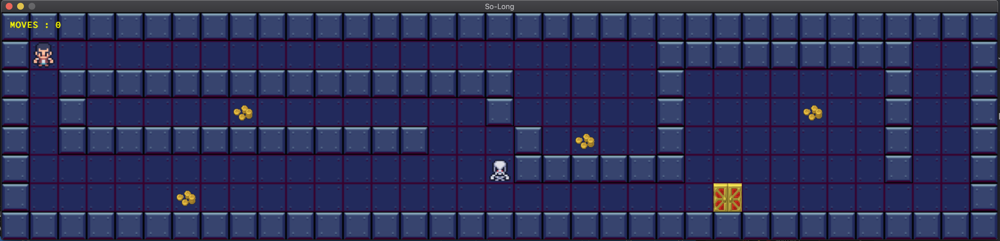

<h1 align="center">42_SO_LONG_1337</h1>
<p align="center">
  <a href="https://github.com/haytham-hammioui/42_So_Long_1337">
    
  </a>
</p>

# So_long

`so_long` is a project from 42 School that focuses on building a simple game using C and the MiniLibX library. This project emphasizes map handling, movement management, and graphical performance optimization, providing hands-on experience in 2D game programming and working with graphical assets. It serves as an important step in mastering memory management, user interaction, and event handling, making it a solid foundation for future projects. 🚀🎮 .



## Getting Started
1. **Check :**
  ```sh
  🚨 Please check that you have mlxlib installed in your machine.
  ```
2. **Install mlxlib**
  If you don't have mlxlib installed, follow these steps:
    - For macOS:
    ```sh
      tar -xvzf minilibx_mac.tgz
      cd minilibx_opengl_20191021
      make
    ```
    - For Linux:
    ```sh
      tar -xvzf minilibx-linux.tgz
      cd minilibx-linux
      make
    ```
3. **Clone the Repository**
   ```sh
   git clone https://github.com/haytham-hammioui/42_So_Long_1337.git so_long
   ```
4. **Ensure Correct Path to `mlx.h`**
   Make sure that the path to the MiniLibX header file (`mlx.h`) is correctly set in your project files. If `mlx.h` is located in a custom path,
   you can specify it as follows:
     - In so_long.h or so_long_bonus.h:
     ```sh
     # include "/path/to/your/mlx.h"
     ```
### Usage
To use `So_long` :
  ```sh
  cd so_long
  cd mandatory or bonus
  make
  ```
To run the game, provide a valid map file with the .ber extension :
  ```sh
  mandatory : ./so_long [map_file.ber]
  bonus : ./so_long_bonus [map_file.ber]
  ```
Only map files with the .ber extension are supported. Example map files can be found in the maps/ directory.

For instance, to run the game with a sample map:
  ```sh
  ./so_long maps/map1.ber
  ./so_long_bonus maps/map1.ber
  ```
### HOW TO PLAY
The player’s goal is to collect all collectibles present on the map then escape with minimal movement.

|KEYBOARD|ACTION|
|---|---|
|`W`, `↑`|Move up|
|`S`, `↓`|Move down|
|`A`, `←`|Move left|
|`D`, `→`|Move right|
|`ESC ⎋`|Close the game window|

## Contributing

Contributions to `so_long` are welcome! Whether you've found a bug, have a feature request, or want to contribute code:

1. Fork the repository.
2. Create a new branch for your changes.
3. Add your contributions.
4. Push your branch and open a pull request against the `so_long` repository.

## Support

If you encounter any issues or have questions about `so_long`, please open an issue on the GitHub repository.

    
